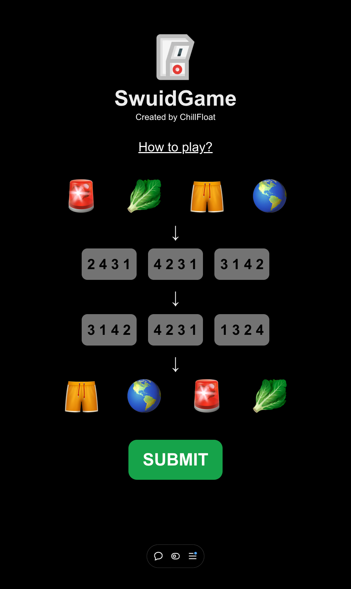

# SwuidGame
SwuidGame (switch-game) is a fun and interactive web-based game built with Next.js and React, designed to challenge your logic and pattern-matching skills. The game involves rearranging and interpreting sequences of numbers and emojis in a dynamic and engaging way.

## Features
- 🎮 Interactive Gameplay: Choose and match sequences from shuffled rows to solve the puzzle.
- 🌟 Dynamic Shuffling: Sequences are randomized for every round to ensure a unique experience.

## How to Play
- Look at the two rows of shuffled numbers.
- Select one sequence from each row by clicking the buttons.
- Arrange the emojis according to the first row, then check the result using the second row.
- Press Submit to see if your answers are correct.

## License
[MIT](https://choosealicense.com/licenses/mit/)